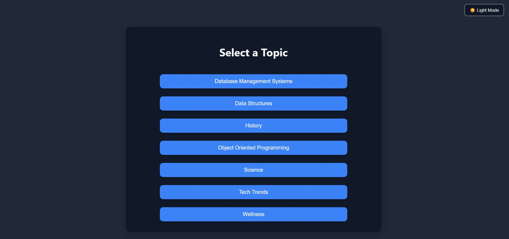
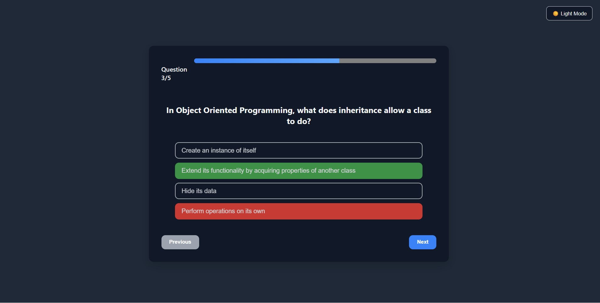

# AI Quiz Web App for Plum Placement Drive

This is a responsive Quiz Web Application built with **React.js** for the frontend and a **Node.js/Express backend**. The app dynamically generates multiple-choice questions using the **GPT-4o-mini OpenRouter API**.

---

## Features

- **Dynamic Question Generation:** Questions are generated in real-time using GPT-4o-mini.
- **Multiple Choice Questions:** 5 questions per topic with 4 options each.
- **Progress Tracking:** Progress bar shows quiz completion status.
- **Answer Feedback:** Correct and wrong answers are highlighted with colors and animations.
- **Animations:** Smooth fade-in animations for questions and selection effects.
- **Dark & Light Themes:** Toggle between dark and light modes.
- **Mobile Responsive:** Fully responsive for tablets and mobile devices without overflow.
- **No Scrollbars:** Scrollbars are hidden for clean UI.

---

## Architecture & State Management

### Frontend:
- Built with **React.js**.
- Main Components:
  - `TopicSelect`: Allows users to select a quiz topic.
  - `Quiz`: Displays questions, options, and navigation buttons.
  - `Result`: Shows final score and feedback.
  - `Loader`: Loading screen while fetching questions.
- State Management:
  - **React `useState` and `useEffect` hooks** for managing current question, selected answers, score, and theme toggle.
  - Conditional rendering used to switch between `Quiz` and `Result` components.
  - Progress bar updated based on current question index.

### Backend:
- Built with **Node.js** and **Express**.
- Handles API requests to **GPT-4o-mini OpenRouter**.
- Returns question JSON to frontend in a strict format.
- Ensures consistency in question count and structure.

---

## Prompts Used and Refinements Made

- **Prompt used to generate questions:**  
  `Generate 5 multiple-choice questions on "${topic}".
    
  Format output strictly as JSON:
  
  [
  
    {"q": "Question text", "options":["A","B","C","D"], "correct": 1}
  
  ]`

- **Other small prompts I used for refinements with ChatGPT:**
  - CSS tweaks to hide scrollbars and center container vertically and horizontally on mobile.
  - Adjustments for responsive container height and width.
  - Theme toggle and animation guidance.

- **Refinements & Adjustments:**
  - Ensured JSON output strictly follows the required format to avoid frontend parsing errors.  
  - Limited options to exactly 4 per question.  
  - Added the `correct` field for the correct option index.  
  - Adjusted questions for clarity and concise phrasing.  
  - Found and configured a free GPT-4o-mini OpenRouter API key (this was a bit tricky).  
  - ChatGPT helped me with **CSS animations, responsive design tweaks, and theme toggle**, but all core logic and project structure were implemented manually.

---

## Example JSON Output from Backend

[

  {
  
    "q": "What is the capital of France?",
    
    "options": ["Paris", "London", "Berlin", "Madrid"],
    
    "correct": 0
    
  },
  
  {
  
    "q": "Which planet is known as the Red Planet?",
    
    "options": ["Earth", "Mars", "Jupiter", "Venus"],
    
    "correct": 1
    
  },
  
  {
  
    "q": "Who wrote the play 'Romeo and Juliet'?",
    
    "options": ["Charles Dickens", "Mark Twain", "William Shakespeare", "Leo Tolstoy"],
    
    "correct": 2
    
  },
  
  {
  
    "q": "What is the largest ocean on Earth?",
    
    "options": ["Atlantic Ocean", "Indian Ocean", "Arctic Ocean", "Pacific Ocean"],
    
    "correct": 3
    
  },

  {
    "q": "What is the chemical symbol for gold?",
    
    "options": ["Au", "Ag", "Gd", "Go"],
    
    "correct": 0
    
  }
  
]

- `q` → Question text displayed in the quiz.  
- `options` → Array of options displayed as buttons.  
- `correct` → Index of the correct option.

---

## Technical Details: Theme, Progress, and Animations

- **Dark & Light Theme Toggle:**  
  - Implemented using CSS variables (`:root`) and a `dark` class on `body`.  
  - React `useState` manages the current theme.
  - Smooth transitions for background, text, and button colors.

- **Progress Bar:**  
  - Updated dynamically based on `currentQuestionIndex / totalQuestions`.  
  - Custom styling with gradient colors.  
  - Compatible with both themes.

- **Answer Feedback & Animations:**  
  - Correct answers highlighted in green, wrong in red.  
  - Selection animation using CSS `scale` transform.  
  - Smooth fade-in for question transitions.  
  - Disabled buttons after selection to prevent multiple clicks.

---

## Screenshots & Demo

- **Topic Selection Screen:**  
  

- **Quiz Screen (with progress, animations, and themes):**  
  

- **Result Screen:**  
  

- **Demo Video:**  
  [Watch Demo][(./ai-quiz-recording.mp4)](https://github.com/user-attachments/assets/c07728fb-8795-4b49-bae5-94916d0061b3)

---

## Known Issues

- Currently supports only **5 questions per topic**.
- No timer functionality yet.

---

## Potential Improvements

- Add **timer** for each question.
- Save **user progress** to backend for resuming quizzes.
- Support **more question formats**, like true/false or image-based questions.
- Add **analytics dashboard** for scores and topics.
- Add **sound effects** and more interactive animations.

---

## Technologies Used

- **Frontend:** React.js, HTML, CSS
- **Backend:** Node.js, Express
- **API:** GPT-4o-mini OpenRouter for question generation
- **State Management:** React Hooks (`useState`, `useEffect`)

---

## How to Run Locally

1. Clone the repository:  
   `git clone <repo-url>`

2. Install dependencies:  
   `cd backend`  
   `npm install`  
   `cd ../frontend`  
   `npm install`

3. Set up GPT-4o-mini OpenRouter API key in `.env`.

4. Start backend server:  
   `cd backend`  
   `npm start`

5. Start frontend:  
   `cd frontend`  
   `npm start`

6. Open `http://localhost:5173` (or the port displayed) to use the quiz.

---

## Acknowledgments

- GPT-4o-mini OpenRouter API for question generation.
- ChatGPT for small styling and responsive design guidance.
- All project logic, components, and API integration were implemented manually.
